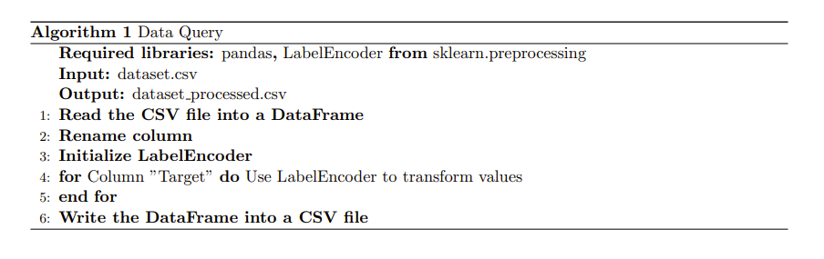
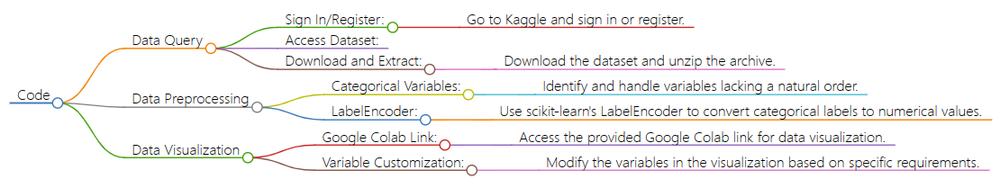

## Description

This repository contains the data query (preprocessing) and the data visualization sections of the project.

## Data Query

The data was directly downloaded from kaggle www.kaggle.com. The following steps show the querying process.

### Step 1

Go to www.kaggle.com. Click **Sign in** or **Register**.

### Step 2

After successfully logging into kaggle, go to https://www.kaggle.com/datasets/thedevastator/higher-education-predictors-of-student-retention.

### Step 3

Click **Download(89kb)**.

### Step 4

A file named **archive.zip** will be downloaded. UnZip it. There will be a file named **dataset.csv**.

## Data Preprocessing

A categorical variable comprises values that can be categorized into distinct groups based on a specific characteristic. Unlike ordinal variables, categorical variables lack a natural order among their categories. These variables, also known as qualitative or attribute variables, cannot be directly processed by most machine learning algorithms. To address this, it is necessary to convert categorical variables into numerical values. The performance of many algorithms is influenced by the chosen encoding method for categorical variables.

To handle categorical variables and facilitate their integration into machine learning workflows, one commonly used tool is the LabelEncoder class from the scikit-learn library (sklearn). The LabelEncoder is designed to transform categorical labels into numerical representations, thus enabling machine learning algorithms to work with them effectively.

## Data Visualization

To visualize the value count of necessary columns of the processed data, please go though this link. 

[View Interactive Chart](./columns.html)

It's recommended to use the following link to visualize data by showing the relationship between variables.

[View Relationship](https://colab.research.google.com/drive/1sOyhy07Wqr4DO9uS9iq0C0q5Q9HYoWwU?usp=sharing)

Please change the following into the specific variables you would like to visualize. In this example, it shows relationship between Course and GDP.

Figure 1: Instruction

## Flowchart

Figure 2: Flowchart Created by Markmap
