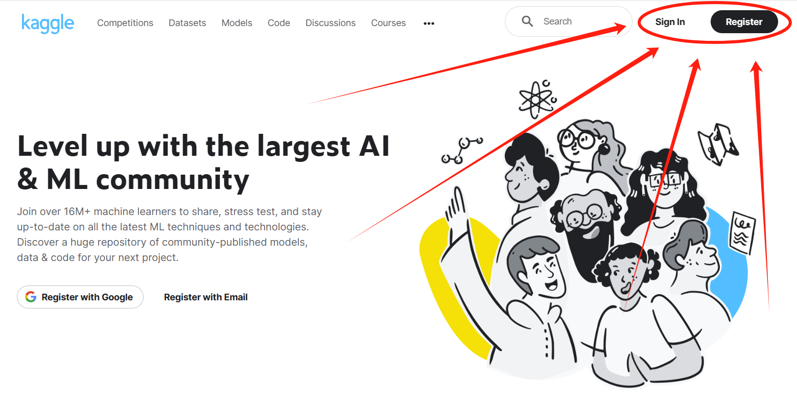
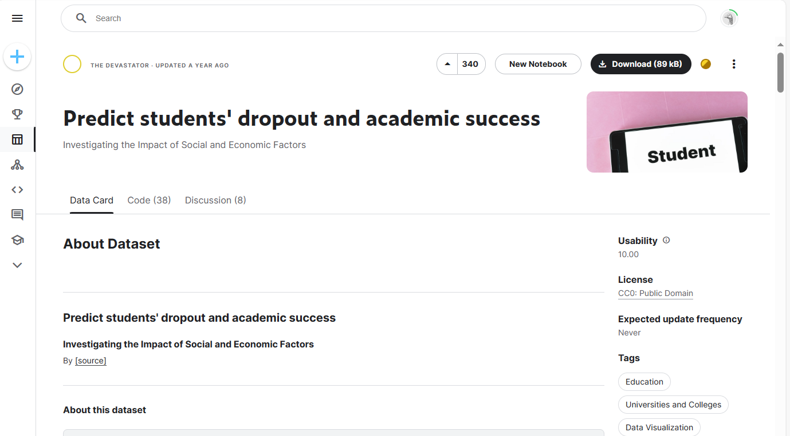
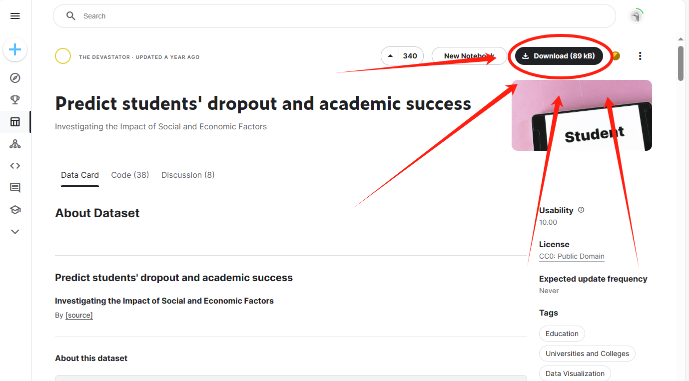
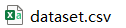
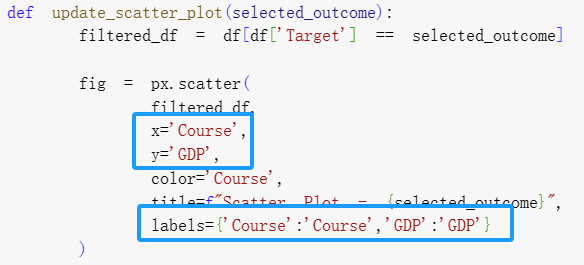

## Description

This repository contains the data query (preprocessing) and the data visualization sections of the project.

## Data Query

The data was directly downloaded from kaggle www.kaggle.com. The following steps show the querying process.

### Step 1

Go to www.kaggle.com. Click **Sign in** or **Register**.

### Step 2

After successfully logging into kaggle, go to https://www.kaggle.com/datasets/thedevastator/higher-education-predictors-of-student-retention.

### Step 3

Click **Download(89kb)**.

### Step 4

A file named **archive.zip** will be downloaded. UnZip it. There will be a file named **dataset.csv**.

## Data Visualization

It's recommended to use the following google colab link to visualize data by showing the relationship between variables.

https://colab.research.google.com/drive/1sOyhy07Wqr4DO9uS9iq0C0q5Q9HYoWwU?usp=sharing

Please change the following into the specific variables you would like to visualize.

