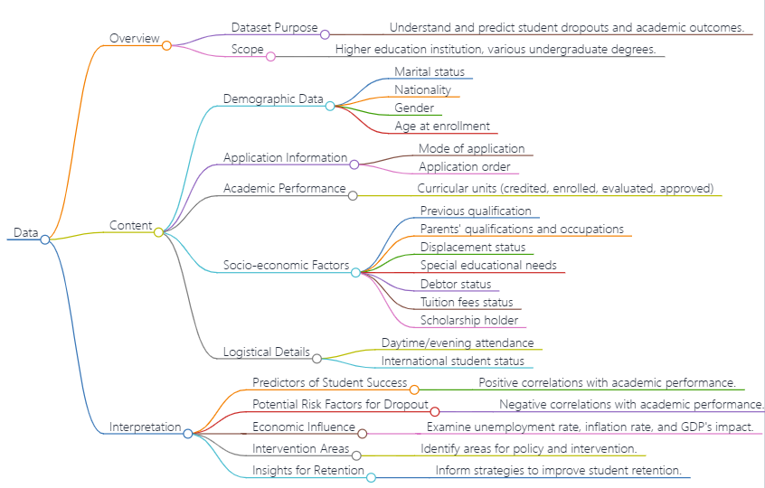

# Data

## Description 

- This dataset presents a comprehensive overview of undergraduates across diverse programs at a higher education institution. It encompasses demographic details, socio-economic indicators, and academic performance data, facilitating an analysis of potential factors influencing student dropout and success. The dataset comprises disparate databases with pertinent information recorded at enrollment, covering application mode, marital status, chosen courses, and more. Moreover, it allows the estimation of overall student performance each semester, considering credited/enrolled/evaluated/approved curricular units and their corresponding grades. Additionally, regional unemployment rate, inflation rate, and GDP offer insights into how economic factors impact student outcomes. This robust analytical tool sheds light on motivations behind students' persistence or abandonment across disciplines like agronomy, design, education, nursing, journalism, management, social service, and technology.
- The dataset can be queried from [kaggle](https://www.kaggle.com/datasets/thedevastator/higher-education-predictors-of-student-retention). Also please see [Dataset Reference](#Dataset-reference). This dataset is supported by program "SATDAP - Capacitação da Administração Pública under grant POCI-05-5762-FSE-000191, Portugal".

## Rational for using Dataset

The dataset chosen for this research is highly pertinent to the study's objectives of unraveling the complex dynamics influencing student dropout and degree completion. As highlighted in the research idea, the dataset encompasses a comprehensive set of variables, including demographic data, socioeconomic factors, and academic performance information. The utilization of such a multifaceted dataset aligns with the scholarly discourse on student success, as emphasized by Tinto (1975) and Pascarella & Terenzini (2005). By incorporating features such as application mode, marital status, course selection, and economic indicators like unemployment rate, inflation, and GDP, the dataset allows for a nuanced exploration of the predictive factors associated with student outcomes. Furthermore, the dataset's potential for facilitating the development of predictive models, as proposed by Bean & Metzner (1985) and Aguinis et al. (2013), underscores its suitability for identifying at-risk students and implementing timely interventions. Overall, the dataset's richness and diversity make it a robust resource for conducting the proposed multifaceted analysis and contributing valuable insights to the broader field of higher education research, specifically helping me identify predictive factors associated with student dropout or successful degree completion, particularly focusing on non-academic factors such as socioeconomic background and student demographics.

## Data Dictionary
| Variable                         | Definition                                  | Description                                               | Unit            | Type                  |
|----------------------------------|---------------------------------------------|-----------------------------------------------------------|-----------------|-----------------------|
| Marital status                   | Marital status of the student.              | -                                                         | -               | Categorical           |
| Application mode                 | Method of application used by the student. | -                                                         | -               | Categorical           |
| Application order                | Order in which the student applied.         | -                                                         | -               | Numerical             |
| Course                           | Course taken by the student.                | -                                                         | -               | Categorical           |
| Daytime/evening attendance       | Student's attendance preference.            | Day or evening classes attendance.                         | -               | Categorical           |
| Previous qualification           | Student's qualification before enrollment.  | -                                                         | -               | Categorical           |
| Nationality                      | Nationality of the student.                | -                                                         | -               | Categorical           |
| Mother's qualification           | Qualification of the student's mother.      | -                                                         | -               | Categorical           |
| Father's qualification           | Qualification of the student's father.      | -                                                         | -               | Categorical           |
| Mother's occupation              | Occupation of the student's mother.         | -                                                         | -               | Categorical           |
| Father's occupation              | Occupation of the student's father.         | -                                                         | -               | Categorical           |
| Displaced                        | Student's displacement status.             | Whether the student is a displaced person.                | -               | Categorical           |
| Educational special needs        | Special educational needs of the student.  | Whether the student has any special educational needs.    | -               | Categorical           |
| Debtor                           | Student's debtor status.                   | Whether the student is a debtor.                          | -               | Categorical           |
| Tuition fees up to date          | Tuition fees payment status.               | Whether the student's tuition fees are up to date.        | -               | Categorical           |
| Gender                           | Gender of the student.                     | -                                                         | -               | Categorical           |
| Scholarship holder               | Scholarship status of the student.         | Whether the student is a scholarship holder.              | -               | Categorical           |
| Age at enrollment                | Age of the student at enrollment.          | -                                                         | years           | Numerical             |
| International                    | International student status.             | Whether the student is an international student.          | -               | Categorical           |
| Curricular units 1st sem (credited) | Number of credited curricular units in the first semester. | Number of curricular units credited by the student in the first semester. | - | Numerical             |
| Curricular units 1st sem (enrolled) | Number of enrolled curricular units in the first semester. | Number of curricular units enrolled by the student in the first semester. | - | Numerical             |
| Curricular units 1st sem (evaluations) | Number of evaluated curricular units in the first semester. | Number of curricular units evaluated by the student in the first semester. | - | Numerical             |
| Curricular units 1st sem (approved) | Number of approved curricular units in the first semester. | Number of curricular units approved by the student in the first semester. | - | Numerical             |

## Sample Observation

| Marital status | Application mode | Application order | Course | Daytime/evening attendance | Previous qualification | Nationality | Mother's qualification | Father's qualification | Mother's occupation | Father's occupation | Displaced | Educational special needs | Debtor | Tuition fees up to date | Gender | Scholarship holder | Age at enrollment | International | Curricular units 1st sem (credited) | Curricular units 1st sem (enrolled) | Curricular units 1st sem (evaluations) | Curricular units 1st sem (approved) | Curricular units 1st sem (grade) | Curricular units 1st sem (without evaluations) | Curricular units 2nd sem (credited) | Curricular units 2nd sem (enrolled) | Curricular units 2nd sem (evaluations) | Curricular units 2nd sem (approved) | Curricular units 2nd sem (grade) | Curricular units 2nd sem (without evaluations) | Unemployment rate | Inflation rate | GDP | Target |
|-----------------|-------------------|---------------------|--------|-----------------------------|-------------------------|-------------|-------------------------|-------------------------|----------------------|----------------------|-----------|-----------------------------|--------|------------------------|--------|----------------------|-------------------|------------------|----------------------------------|------------------------------------|---------------------------------------|-----------------------------------|----------------------------|----------------------------------------------|----------------------------------|------------------------------------|---------------------------------------|-----------------------------------|---------------------------------|------------------------------------------|---------------------|----------------|-----|--------|
| 1               | 8                 | 5                   | 2      | 1                           | 1                       | 1           | 13                      | 10                      | 6                    | 10                   | 1         | 0                           | 0      | 1                      | 1      | 0                    | 20                | 0                              | 0                                | 0                                   | 0                               | 0                           | 0                                              | 0                                | 0                              | 0                                 | 0                                 | 0                             | 0                           | 0                                          | 10.8                | 1.4            | 1.74| Dropout|


## Flowchart


Figure 1: Flowchart for Data Created by Markmap

## Reference
```
@article{aguinis2013making,
  title={Making business school research more relevant for practice},
  author={Aguinis, Herman and Culpepper, Sheri A and Pierce, Charles A},
  journal={Journal of Management},
  volume={39},
  number={6},
  pages={1647--1668},
  year={2013},
  publisher={Wiley Online Library}
}

@article{bean1985conceptual,
  title={A conceptual model of nontraditional undergraduate student attrition},
  author={Bean, John P and Metzner, Barbara S},
  journal={Review of Educational Research},
  volume={55},
  number={4},
  pages={485--540},
  year={1985},
  publisher={SAGE Publications Sage CA: Los Angeles, CA}
}

@book{pascarella2005how,
  title={How college affects students: A third decade of research},
  author={Pascarella, Ernest T and Terenzini, Patrick T},
  year={2005},
  publisher={Jossey-Bass}
}

@article{tinto1975dropout,
  title={Dropout from higher education: A theoretical synthesis of recent research},
  author={Tinto, Vincent},
  journal={Review of Educational Research},
  volume={45},
  number={1},
  pages={89--125},
  year={1975},
  publisher={SAGE Publications Sage CA: Los Angeles, CA}
}
```
## Dataset Reference
- Valentim Realinho, Jorge Machado, Luís Baptista, & Mónica V. Martins. (2021). Predict students' dropout and academic success (1.0) [Data set]. Zenodo. https://doi.org/10.5281/zenodo.5777340
- https://www.mdpi.com/2306-5729/7/11/146

