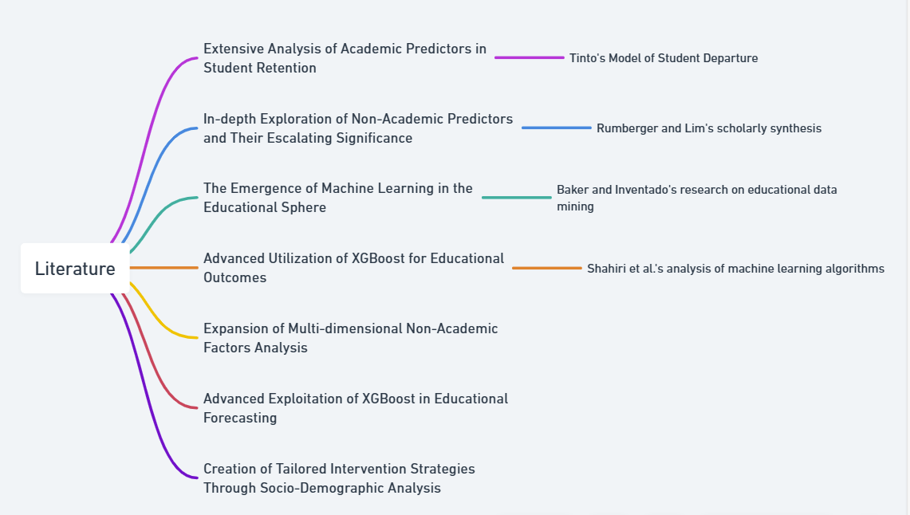

# Literature

## Description:

The following content is the **LITERATURE** part of the project. This repository presents how this project connects to and advances existing research.  

## Literature Review

**Extensive Analysis of Academic Predictors in Student Retention:**
Tinto's (1975) influential Model of Student Departure lays the groundwork for a comprehensive understanding of how students integrate academically and socially, and how these integrations can critically forecast the likelihood of their persistence in higher education. Over the years, Tinto's framework has been widely accepted as a crucial paradigm for interpreting student retention figures and driving institutional strategies toward minimizing dropout rates.

**In-depth Exploration of Non-Academic Predictors and Their Escalating Significance:**
The scholarly synthesis by Rumberger and Lim (2008) elucidates a wide array of factors outside the academic sphere that contribute to student attrition, underlining the consequential role that variables such as personal circumstances and external commitments can play. Their findings place an increasing emphasis on the need to consider the whole student experience in retention studies, rather than focusing solely on their academic performance.

**The Emergence of Machine Learning in the Educational Sphere**
Baker and Inventado (2014) defines the emergence of educational data mining and lays a conceptual foundation for the integration of machine learning methodologies in the educational domain. Their research paves the way for cutting-edge tools to proactively identify at-risk students by analyzing patterns within large educational datasets.

**Advanced Utilization of XGBoost for Educational Outcomes:**
Shahiri et al. (2015) intensively analyzed various machine learning algorithms to predict academic success, highlighting the notable efficiency of the XGBoost algorithm. This specific machine learning technique has demonstrated its ability to outperform other algorithms in the realm of educational data prediction, marking a significant step forward in this aspect of educational technology.

## Research Advancements

**Expansion of Multi-dimensional Non-Academic Factors Analysis:**
This research innovatively expands on the foundational work of Rumberger and Lim (2008) by integrating a more expansive array of non-academic factors, including financial constraints, cultural influences, and demographic characteristics. The result is a multifaceted predictive framework that offers a more nuanced understanding of student retention, potentially revolutionizing retention strategies to be more inclusive and responsive to a diverse student body.

**Advanced Exploitation of XGBoost in Educational Forecasting:**
Further refining the insights of Shahiri and colleagues, this study delves deeper into the XGBoost algorithm's potential. It systematically assesses the weight of the combined academic and non-academic factors in the prediction models, thus sharpening the focus on what contributes to a student's likelihood of continuing their education, thus yielding potentially more accurate and actionable predictions.

**Creation of Tailored Intervention Strategies Through Socio-Demographic Analysis:**
Inspired by Baker and Inventado's (2014) work on socio-economic patterns in education, this research conducts a profound analysis of students' socio-demographic backgrounds to tailor intervention strategies more effectively. By employing advanced profiling and prediction techniques, the research aims to facilitate higher education institutions in developing finely-tuned support mechanisms that address the specific needs of individual students or student groups, consequently bridging the gap between broad-spectrum policies and personalized educational support.

## Flowchart

## References:
