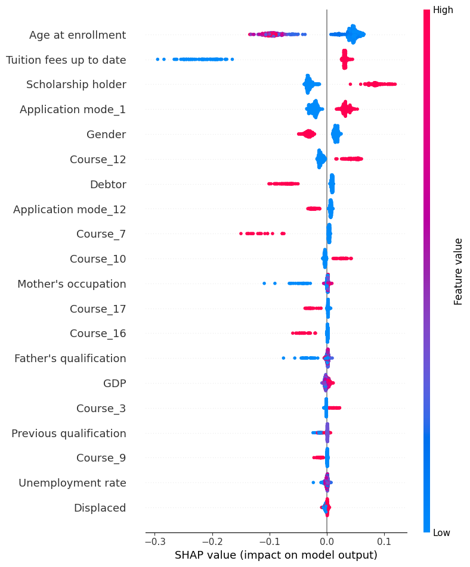
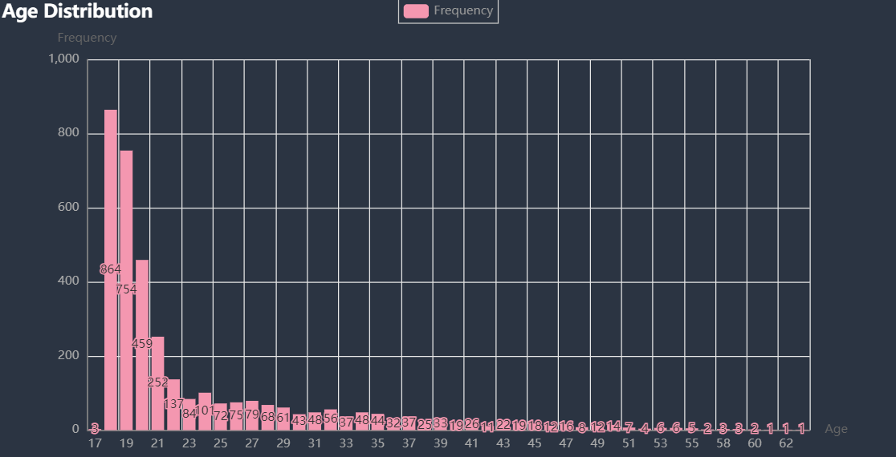
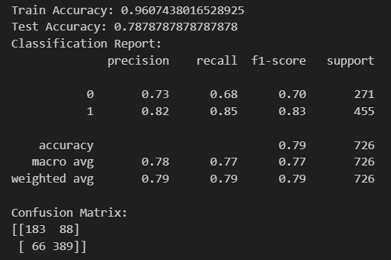
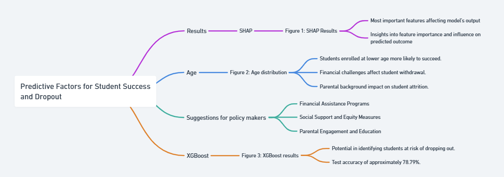

## Description
This section describes how the research answers the research questions based on the specific methods.

## Results

### Predictive Factors

**Figure 1: SHAP Results**

This figure is a summary plot showing the most important features affecting the model's output. Each point on the summary plot represents the SHAP value (a measure of the importance of each feature in the prediction) of a feature for an instance. The features are sorted by the sum of SHAP value magnitudes over all samples, where the color represents the value of the feature (from low to high). This visualization provides insights into which features are most important and how they influence the predicted outcome.

We can conclude using row "Age at enrollment", "Application mode_12", and **Figure 2** that for higher education, students enrolled at lower age, specifically from 17 - 23, are significantly more likely to succeed.

**Figure 2: Age distribution**

We may also deduce that students facing financial challenges, such as accruing debts, have a considerably higher propensity to withdraw from their studies, whereas those receiving scholarships have a markedly increased chance of academic success.

Furthermore, it is noteworthy that although having parents with a high educational level and professional status does not necessarily enhance a student's likelihood of succeeding, a lower socio-economic status of the parental background is often associated with a greater risk of student attrition.

#### Suggestions for policy makers

- Financial Assistance Programs:
  Expand scholarship programs that target students from low to middle-income families to alleviate financial barriers to education.
  Implement or enhance counseling services that assist students in management of their finances and awareness of financial aid opportunities.
  Consider policy changes that would reduce the reliance on loans or the burden of debt for students, as this is a significant factor in student withdrawal.

- Social Support and Equity Measures:
   Develop support systems and mentoring programs aimed specifically at students from lower socio-economic backgrounds to reduce dropout rates.
   Establish partnerships with high schools in less-privileged areas to create pipelines for students to higher education institutions.
   Review admission criteria to ensure they are not indirectly biased against those from lower socio-economic backgrounds.
  
- Parental Engagement and Education:
While the educational level of parents might not guarantee student success in higher education, parental engagement is still key.
  Create adult education programs or workshops for parents to become more involved and informed about their children's educational journey.
  Fund initiatives that aim to bridge the educational gap for parents, thus indirectly supporting the academic pursuits of their children.
  
### XGBoost

**Figure 3: XGBoost**

XGBoost offers significant potential in identifying students at risk of dropping out by analyzing complex interactions among various predictors such as demographic characteristics, financial circumstances, and socio-economic backgrounds. The removal of academic performance significantly increased the difficulty of model training. Despite the moderate test accuracy illustrated in the presented model results, the performance is acceptable, considering the challenging nature of social behavior prediction. The ability of XGBoost to handle a variety of data types, its robustness to outliers, and its capacity to capture nonlinear relationships make it particularly apt for educational data, which often involves heterogeneous features and imbalanced classes. Moreover, the model's test accuracy of approximately 78.79% is promising given the context and complexity of educational data, signaling that with further fine-tuning and by addressing issues like overfitting, the model could become an even more reliable tool. Leveraging the XGBoost algorithm can enable educational institutions to proactively deploy interventions and support mechanisms tailored to individual student profiles, thereby mitigating dropout rates and fostering an inclusive and supportive learning environment.

## Flowchart

